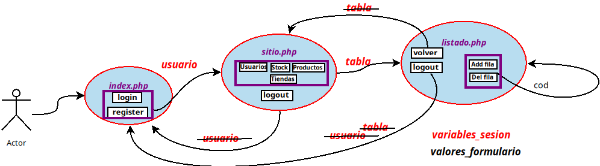

# practica_crud
* Se adjunta en entorno de ejecución en la carpeta **docker**
* Puertos mapeados:
  * 8800 para la app http://localhost:8800
  * 8100 para acceder a phpmyadmin http://localhost:8100
* Se adjunta una base de datos con datos para gestionar
* Las credenciales para acceder a la base de datos: 
```bash
HOST=mysql
DB_USER=alumno
PASSWORD=alumno
DATABASE=tienda
ROOT_PASSWORD=root_password 
```

* **diagrama de navegación**


[Enunciado de la práctica en el fichero](practica_crud.pdf)